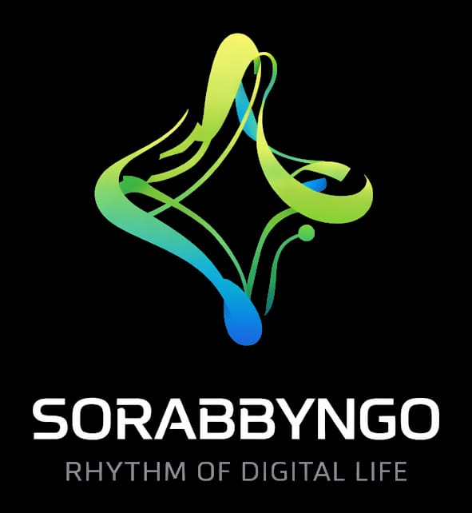

$(cat /mnt/user-data/outputs/README.md)

 

**Africa-first. Offline-first. AI-native.**

We build the operating system, intelligence layer, and infrastructure stack that makes sovereign AI real — starting in Kenya, scaling across the continent.

---

---

## What We're Building

Sorabbyngo is a technology company headquartered in **Kisii, Kenya**. We are building a sovereign AI operating system designed for the realities of Africa — intermittent connectivity, low-resource hardware, multilingual users, and the need for data to stay local.

Our work spans the kernel, the network, the intelligence layer, and the applications that run on top of it — an integrated vertical stack, not a collection of disconnected tools.

---

## The Stack
┌─────────────────────────────────────────────────────────┐
│                    APPLICATIONS                         │
│              Novela · Byngox · Chameha                  │
├─────────────────────────────────────────────────────────┤
│                 INTELLIGENCE LAYER                      │
│         CML · ARAM · Sorabbyngo Models · Vector         │
├─────────────────────────────────────────────────────────┤
│                  NETWORK & IDENTITY                     │
│         Byngonet · Identity Core · Event Bus            │
├─────────────────────────────────────────────────────────┤
│                   OS & KERNEL                           │
│    Sorabbyngo OS (Linux 6.19.10) · NodeID · Sentinel    │
├─────────────────────────────────────────────────────────┤
│                SECURITY & COMPLIANCE                    │
│        Citadel · Cyberwall · 7-Ring Defence             │
└─────────────────────────────────────────────────────────┘
---

## Our Organizations

We work in focused, domain-specific organizations. Explore each one:

| Organization | Domain | What Lives Here |
|---|---|---|
| [**sorabbyngo-os**](https://github.com/sorabbyngo-os) | Operating System | Custom Linux 6.19.10 kernel, NodeID driver, Byngonet, build toolchain, Chameha, ADRs |
| [**novela-health**](https://github.com/novela-health) | Healthcare Intelligence | Novela clinical AI platform, CML compliance layer, Kenya DPA 2019 enforcement |
| [**soraxis-tech**](https://github.com/soraxis-tech) | Agent Systems | Byngox 8-agent swarm engine — health, drug, context, network, learning, population agents |
| [**citadel-sec**](https://github.com/citadel-sec) | Security & Defence | 7-ring defence architecture, Cyberwall AI firewall, identity forensics, PKI, cyber lab |
| [**sorabyte-cloud**](https://github.com/sorabyte-cloud) | Cloud Infrastructure | Sorabbyngo cloud layer, Tier 3 opt-in cloud services, server-os |
| [**sorabbyngo-vector**](https://github.com/sorabbyngo-vector) | AI & Data | Model registry, vector database, GraphRAG, Data Factory, ARAM intelligence platform |
| [**sorabbyngo-headquarters**](https://github.com/sorabbyngo-headquarters) | Company Operations | Strategy, governance, company-wide documentation |
| [**sorabbyngo-people**](https://github.com/sorabbyngo-people) | People & Culture | Hiring, team handbook, onboarding |
| [**sorabbyngo-Labs**](https://github.com/sorabbyngo-Labs) | R&D | Experimental projects, research, prototypes |

---

## Core Principles

**Offline-first by design.**
The OS and all core services operate fully without internet. Cloud is opt-in, never default. `ENABLE_CLOUD_AI=false`.

**Hardware identity at the kernel level.**
Every node has a cryptographic NodeID derived from hardware — SHA-256 of CPU + MAC — enforced by a custom Linux Security Module. You can't spoof your way onto the mesh.

**Africa-first, not Africa-adapted.**
We don't take Western products and localize them. We build from the ground up for low-resource hardware, Swahili + English voice interfaces, local data sovereignty, and the Kenya Data Protection Act 2019.

**Sovereign AI.**
The intelligence layer runs on curated open-source models — DeepSeek-R1, Meditron-70B, Phi-4, Aya 23, Gemma 3 — on-device, on your hardware, under your control.

---

## Flagship Products

### 🏥 Novela
AI-powered healthcare intelligence for African clinical environments. Runs offline. Speaks Swahili. Trained on African health datasets. Compliant with Kenya DPA 2019.

### 🖥️ Sorabbyngo OS
A custom Linux 6.19.10 operating system with AI runtime baked into the kernel. Features NodeID hardware identity, Byngonet mesh networking, and a tiered inference engine (local → GPU local → cloud opt-in).

### 🌐 Byngonet
An AI-native mesh network protocol with post-quantum security, swarm routing, and NodeID-based packet authentication at the kernel level.

---

## Founder

<table>
<tr>
<td width="80">

</td>
<td>

**Charles Odolo**
Founder & CEO · Sorabbyngo

Builder of systems. Based in Kisii, Kenya. Obsessed with making sovereign, offline-first AI real for Africa — from the kernel up.

</td>
</tr>
</table>

---

## Built in Kenya. Built for the World.

 

Sorabbyngo is headquartered in **Kisii, Kenya**.

We believe the next generation of computing infrastructure for Africa must be built by Africans — not licensed, not imported, not dependent on foreign cloud providers.

If you share that belief, we'd love to connect.

**→ [sorabbyngoltd@gmail.com](mailto:sorabbyngoltd@gmail.com)**

---

*© 2025 Sorabbyngo. All rights reserved.*

